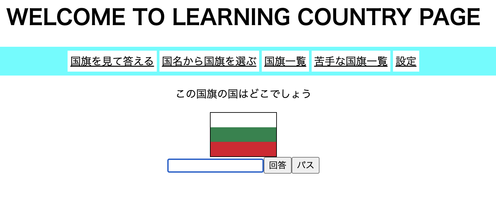

# 国旗の学習用サイト
国旗を学習するためのサイト

「国旗を見て答える」、「国名から国旗を選ぶ」等の学び方ができる。

## インストール方法
```sh
https://github.com/bluecat101/Country-Practice.git
```
もしくは
zipでインストール

## 環境
- Cookieが許可される環境(FireFoxで試しています)
※ Cookieが使用できなくても一部機能が使えなくなるだけで大きな問題はないです。


## 使用方法(モード)
- 国旗を見て答える: 国旗を見て国名を答える
- 国名から国旗を選ぶ: 国名から国旗を答える
- 国旗一覧: 登録されている国旗の表示(Wikiのリンクが貼ってある)
- 苦手国旗一覧: Cookie使用可能時に間違えた国名を知ることができる
- 設定: 出題範囲を全範囲か苦手範囲(間違えた問題)かを設定することができる

## ポイント
- クッキーを使用しているため、サイトを消した後でも苦手範囲を記録しておくことができる
- それぞれの人に合った学び方ができる